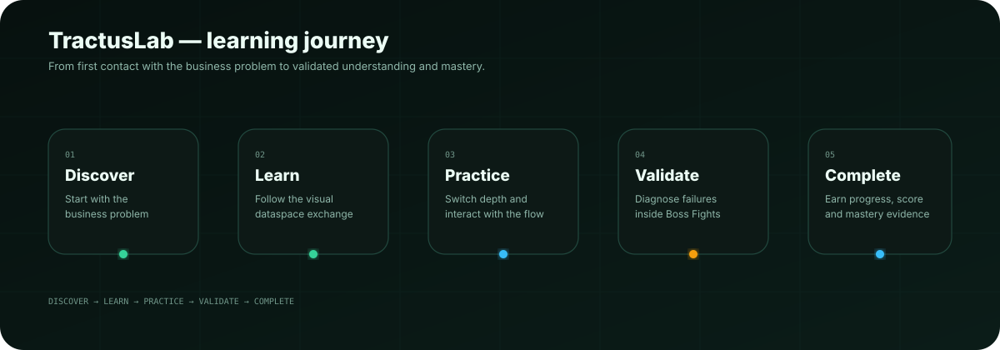
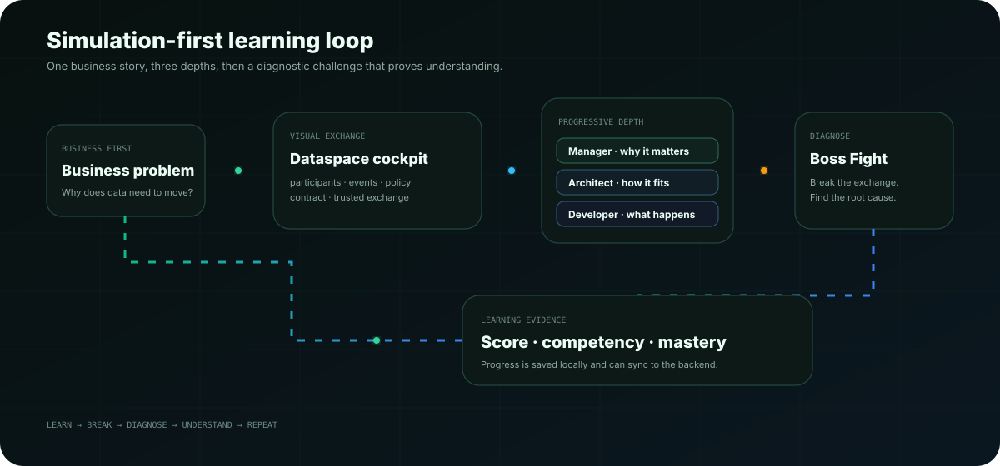
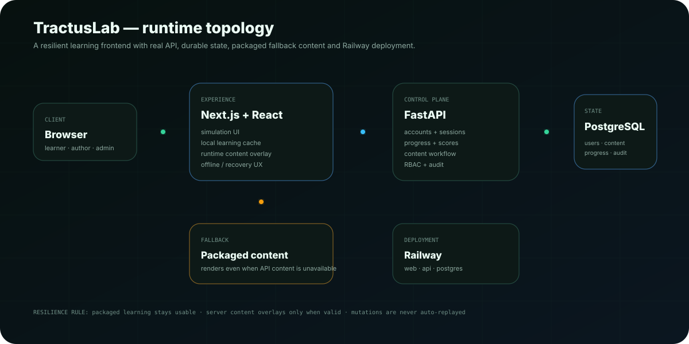

<div align="center">

# TractusLab

### An interactive, simulation-first learning environment for Tractus-X and dataspaces

**Don’t read the dataspace. Run it.**

<br/>


</div>

<p align="center">
  
</p>

---

## The observation

Tractus-X is powerful, but learning it from specifications, repositories and architecture diagrams is hard — especially when the learner first needs to understand **why a dataspace exists at all**.

A manager needs the business story. An architect needs the relationships. A developer needs the protocol and implementation behavior.

Those are three depths of the **same system**, not three separate courses.

TractusLab turns that complexity into something a learner can see, operate, break and diagnose.

```text
Business problem
      ↓
Visual exchange
      ↓
Manager → Architect → Developer
      ↓
Guided mission
      ↓
Boss Fight
      ↓
Diagnosis + score + mastery
```

> **The goal is not to memorize Tractus-X vocabulary. The goal is to build the mental model by using it.**

---

# 1. Learn by running the story

<p align="center">
  
</p>

Every scenario starts with a real business need instead of an acronym.

The learner follows a dataspace exchange step by step, sees which participant is doing what, and can inspect the same moment at different technical depths.

### Three learning depths

| Mode | Question it answers | Focus |
|---|---|---|
| **Manager** | Why does the business need this? | value, trust, decisions, outcome |
| **Architect** | How do the systems fit together? | components, boundaries, relationships |
| **Developer** | What actually happens technically? | payloads, protocols, runtime behavior |

There is also an **Explain-like-I’m-new** mode that removes unnecessary jargon and keeps the story understandable for first-time learners.

---

# 2. The six business missions

TractusLab currently packages six independent learning scenarios:

```text
01  Battery PCF
02  Digital Twin
03  Traceability
04  Demand & Capacity
05  Quality
06  Circular Economy
```

Each mission is versioned content with its own business story, learning steps, technical depth, diagnostics and progression state.

The content is not hard-wired into one giant UI flow. Runtime content can be reviewed, revised and published independently.

---

# 3. The dataspace becomes visible

A dataspace is difficult to learn when it exists only as boxes in documentation.

TractusLab gives the learner an exchange cockpit with a visual system map and event timeline.

```text
Supplier
   │
   │  discover / identify / negotiate
   ▼
Dataspace services
   │
   │  policy + contract + trusted exchange
   ▼
Consumer / Manufacturer
```

The active learning step drives the visual state, so the diagram is not decoration. It explains **where the learner currently is in the exchange**.

The timeline can be revisited at any point, letting a learner move between concepts without losing the business story.

---

# 4. Boss Fights turn knowledge into diagnosis

Reading an explanation is not proof that someone understood it.

After a mission, TractusLab deliberately breaks the exchange.

```text
Catalog              ✓
Identity             ✓
Contract negotiation ✕

What should you inspect first?
```

The learner must diagnose the failure instead of replaying a memorized definition.

Boss Fights support:

- scenario-based decisions,
- component selection,
- workflow diagnosis,
- wrong-answer explanations,
- optional hints with score cost,
- persistent best scores,
- competency and achievement progress.

A wrong answer is part of the learning loop, not a dead end.

```text
observe symptom
      ↓
choose diagnosis
      ↓
wrong? ──► explanation ──► inspect again
      │
      └ correct
          ↓
      root cause
          ↓
      next failure
```

---

# 5. Learning is a journey, not a page

Progress is persisted across the experience.

The learner profile combines:

- mission completion,
- saved learning steps,
- solved diagnostic challenges,
- Boss Fight scores,
- competencies,
- achievements,
- recommended next mission,
- mastery certificate state.

Guest users can start immediately. They can later create an account **without throwing away their local learning progress**.

---

# 6. Content is treated like product code

TractusLab has an Authoring Studio because training content should not require editing React components.

Authors work with structured scenario fields while advanced users can still access the underlying JSON contract.

```text
Draft
  ↓
Review
  ↓
Approved
  ↓
Published
  ↓
Learner runtime
```

The studio includes:

- structured Compose mode,
- Manager / Architect / Developer explanations,
- business-story and learning-step editing,
- live learner preview,
- validation and review-readiness feedback,
- revision history,
- import/export,
- unsaved-draft protection,
- Advanced JSON mode.

Published server revisions may overlay packaged content at runtime. Invalid or unavailable remote content fails safely back to the packaged scenario.

---

# 7. Roles and workflow are explicit

The content workflow uses four roles:

| Role | Responsibility |
|---|---|
| `learner` | consume missions and save progress |
| `author` | create and revise learning content |
| `reviewer` | review and approve revisions |
| `admin` | manage workflow, roles and audit visibility |

Administrative actions and important security/content mutations are captured in a persistent audit trail.

The Authoring Studio also exposes team access, feedback and recent audit history without requiring direct database access.

---

# 8. Runtime architecture

<p align="center">
  
</p>

TractusLab deliberately separates the learning experience from durable account/content state.

The frontend remains useful even when runtime content is temporarily unavailable because packaged learning content is a non-blocking fallback.

---

# 9. Accounts and security

The backend is a real persistence and identity layer, not a demo-only mock.

Implemented controls include:

- Argon2 password hashing,
- opaque revocable bearer sessions,
- guest-to-account upgrade,
- email verification,
- forgot/reset/change password flows,
- active-session inspection and revocation,
- hashed expiring single-use account-action tokens,
- explicit CORS allow lists,
- request-size protection,
- request IDs,
- security headers,
- `Cache-Control: no-store` for auth/state responses,
- abuse/rate-limit protection,
- privacy-conscious audit events.

Mutating requests are deliberately **not automatically replayed** by the resilience layer, preventing accidental duplicate publish, role-change or account actions.

---

# 10. Reliability is part of the learning UX

A training environment should not become confusing when the network behaves badly.

The application includes:

```text
safe GET/HEAD retries
offline / back-online state
route recovery
loading skeletons
product-aware 404
packaged content fallback
local progress cache
server synchronization when available
```

Accessibility is treated as product behavior as well: keyboard focus, skip-to-content, reduced-motion support, minimum control sizing and accessible state semantics are built into the interface.

---

# 11. Technology map

| Layer | Technology |
|---|---|
| Learning experience | Next.js 16.3, React 19.2, TypeScript |
| UI system | Tailwind CSS 4.3 |
| API | FastAPI, Pydantic |
| Durable state | PostgreSQL, SQLAlchemy, Alembic |
| Authentication | Argon2 + opaque revocable sessions |
| Content model | Versioned scenario documents + workflow revisions |
| Deployment | Railway |
| Validation / CI | GitHub Actions, Node tests, Pytest, TypeScript, production build |

---

# 12. Repository map

```text
TractusLab/
├── app/                  Next.js routes and product shell
├── components/           learning, navigation and simulation UI
├── content/              packaged versioned learning content
│   └── documents/        independent scenario documents
├── data/                 scenario catalog and product data
├── lib/                  simulator, runtime and client logic
├── apps/
│   └── api/              FastAPI backend
│       ├── app/          API, auth, content and persistence
│       ├── alembic/      database migrations
│       └── tests/        backend test suite
├── scripts/              content validation tooling
├── tests/                simulator/runtime/frontend tests
└── .github/workflows/    CI pipeline
```

---

# 13. Run locally

### Frontend

```bash
cp .env.example .env.local
npm install
npm run dev
```

### API

```bash
cd apps/api
cp .env.example .env
python -m venv .venv
source .venv/bin/activate  # Windows: .venv\\Scripts\\activate
pip install -r requirements.txt
alembic upgrade head
uvicorn app.main:app --reload --port 8000
```

For local SQLite development, omit `DATABASE_URL`.

To bootstrap an initial content admin locally:

```env
CONTENT_ADMIN_EMAILS=you@example.com
```

---

# 14. Validation and CI

```bash
npm run content:validate
npm test
npm run typecheck
npm run build
PYTHONPATH=apps/api pytest -q apps/api/tests
```

GitHub Actions verifies the database migration path, API/security/RBAC/audit/content workflow, account journeys, scenario contracts, simulator/runtime behavior, TypeScript and the production Next.js build.

---

# 15. Product principles

1. **Business first.** Explain the problem before the acronym.
2. **Simulation first.** Build the mental model through interaction.
3. **Progressive depth.** Manager → Architect → Developer without changing the underlying story.
4. **Practice over passive reading.** Diagnosis proves more than page completion.
5. **Content is a product.** It is versioned, reviewed and publishable.
6. **The interface must explain itself.** The current state and next action should be visually obvious.
7. **Real infrastructure comes after understanding.** EDC, DTR and deeper Tractus-X infrastructure can be introduced once the learner owns the mental model.

---

<div align="center">

## Find it. Understand it. Learn it. Use it.

**TractusMind** turns Tractus-X source material into inspectable engineering knowledge.  
**TractusLab** turns that knowledge into understanding, practice and adoption.

```text
TractusMind                    TractusLab
Find + Understand       →      Learn + Practice
        │                           │
        └──── Knowledge → Understanding → Adoption ────┘
```

### TractusLab
**Don’t read the dataspace. Run it.**

</div>
